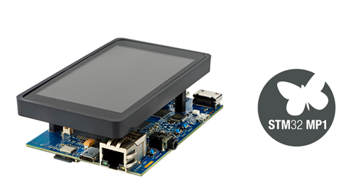
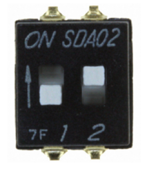

# STM32MP157A-DK1 BSP (Board Support Package) Execution Instruction

[中文页](README_zh.md) |

## Introduction

This document records the execution instruction of the BSP (board support package) provided by the RT-Thread development team for the STM32MP157A-DK1 development board.

The document is covered in three parts:

- STM32MP157A-DK1 Board Resources Introduction

- Quickly Get Started

- Advanced Features

By reading the Quickly Get Started section developers can quickly get their hands on this BSP and run RT-Thread on the board. More advanced features will be introduced in the Advanced Features section to help developers take advantage of RT-Thread to drive more on-board resources.

## STM32MP157A-DK1 Board Resources Introduction

The STM32MP157A-DK1 is a development board based on a dual Cortex-A7 and Cortex-M4 core. The Cortex-A7 core operates at 800 MHZ and the Cortex-M4 operates at 209MHZ. There is no Flash inside the STM32MP157A.

  

The mainly-used **on-board resources** are shown as follows:

- MCU : STM32MP157AACx
- Common peripherals:
  - 4 LEDs: LD4(PA14), LD6(PA13), LD7(PH7), LD8(PD11)
  - 4 Buttons:  WAKE_UP, RESET (NRST), USER1(PA14), USER2 (PA13)
- Common-used interface: USB, SD card, Ethernet, MIPI, USB HOST, Audio, HDMI, Arduino.
- Debug interface: Standard JTAG/SWD.

For more details about this board, please refer to the ST official documentation: [STM32MP157A-DK1 Development board introduction](https://www.st.com/content/st_com/zh/products/evaluation-tools/product-evaluation-tools/mcu-mpu-eval-tools/stm32-mcu-mpu-eval-tools/stm32-discovery-kits/stm32mp157a-dk1.html)

## Peripheral Condition

Each peripheral supporting condition for this BSP is as follows:

| On-board Peripheral            | **Support** |     **Remark**      |
| :----------------------------- | :---------: | :-----------------: |
| USB TO UART                    |     YES     |                     |
| PWR                            |     YES     |                     |
| RCC                            |     YES     |                     |
| SD Card (SDMMC)                |     NO      |                     |
| ETH                            |     NO      |                     |
| AUDIO                          |     NO      |                     |
| **On-chip Peripheral Drivers** | **Support** |     **Remark**      |
| GPIO                           |     YES     |  GPIOA-GPIOK, GPIOZ |
| UART                           |     YES     |   UART4 (ST-Link)   |
| EXTI                           |     YES     |                     |
| SPI                            |     YES     |                     |
| TIM                            |     YES     |                     |
| LPTIM                          |     YES     |                     |
| I2C                            |     YES     | Software & Hardware |
| ADC                            |     YES     |                     |
| DAC                            |     YES     |                     |
| WWDG                           |     YES     |                     |

## Execution Instruction

### Quickly Get Started

This BSP provides IAR projects for developers. Here's an example of the IAR development environment, to introduce how to run the system.

#### Hardware Connection

Use a USB cable to connect the development board to the PC and turn on the power switch.

#### Compile And Download

Double-click the project.eww file, to open the IAR project, compile and download the program to the board.

> By default, the project uses ST_LINK simulator to download the program, when the ST_LINK connects the board, clicking the download button can download the program to the board.

#### Running Results

After the program is successfully downloaded, the system runs automatically. Observe the running results of the LED on the development board, the blue LD8 will flash periodically.

Connect the serial port of the board to PC, communicate with it via a serial terminal tool (115200-8-1-N). Restart the board and the startup information of RT-Thread will be observed:

```c
 \ | /
- RT -     Thread Operating System
 / | \     3.1.1 build Nov 19 2018
 2006 - 2018 Copyright by rt-thread team
msh >
```

### Advanced Features

This BSP only enables GPIO and serial port 4 by default. If need more advanced features, you need to configure the BSP with RT-Thread Env tools, as follows:

- Open the [Env](https://www.rt-thread.io/download.html?download=Env) tool under this BSP;
- Enter the `menuconfig` command to configure the project, then save and exit;
- Enter the  `pkgs --update` command to update the packages;
- Enter the `scons --target=iar` command to regenerate the  project.

## Notes

- Before downloading the program, set the board to the mode of "Engineering Mode".  The BOOT switch sets to BOOT0=0 and BOOT2=1, as shown below:

  

- If need to reburn the program, please reset the development board.

## Contact Information

accendant:

- [liukang](https://github.com/thread-liu)
